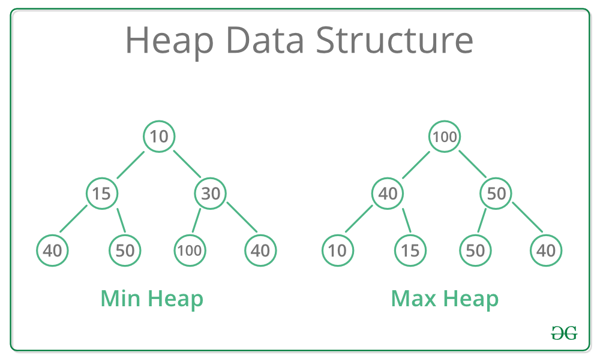

# Binary Heap

# Introduction

It is a complete binary tree. A complete binary tree has all the levels filled except for the last level. The last level is filled from left to right. We do this because we want to store the binary heap ds as an array.

1. Used in heap sort
2. User to implement priority queue data structure
3. Two Types
   a. Min Heap(Highest priority item is assigned lowest value)
   b. Max Heap(Highest priority item is assigned highest value)

# How to access a complete binary tree as an array

arr = [1, 2, 3, 4, 5, 6]
0 1 2 3 4 5

                    tree =>

                                        1
                        2                               3
                4                5              6

left = 2*i+1
right = 2*i + 2
parent = floor((i-1)/2)

# Advantages of storing a complete binary tree as an array

1. Random Access as it is stored in an array
2. Cache Friendly (all items at contiguous locations so we get locality of reference)
3. Complete Binary tree (hright of this tree is minimum possible)

# Types of Binary Heap

## Min Heap

1. Complete binary tree
2. Every node should have value smaller than its decendents.

## Max Heap

1. Complete binary tree
2. Every node should have value larger than its decendents.

# Notes

Getting Maximum Element: In a Max-Heap, the maximum element is always present at the root node which is the first element in the array used to represent the Heap. So, the maximum element from a max heap can be simply obtained by returning the root node as Arr[0] in O(1) time complexity.

Getting Minimum Element: In a Min-Heap, the minimum element is always present at the root node which is the first element in the array used to represent the Heap. So, the minimum element from a minheap can be simply obtained by returning the root node as Arr[0] in O(1) time complexity.

# Operations on a binary heap

1. insert : O(log n) becuase height of BT is determined by log n
